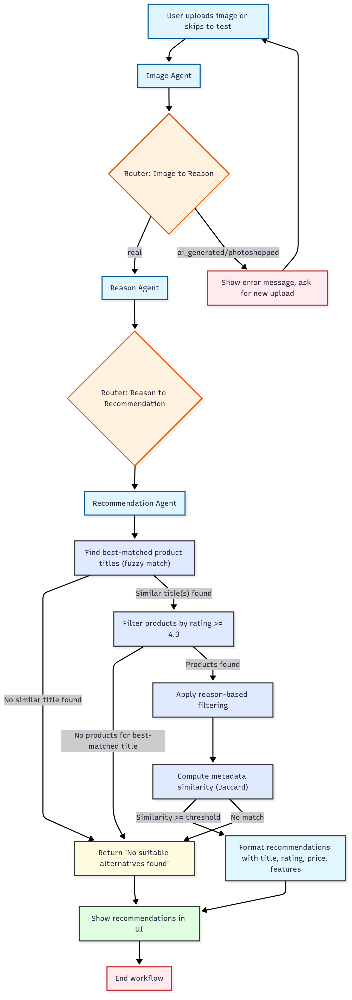

# Product Return Agent

A conversational agent for product returns and recommendations, built with Python, LangGraph, and Streamlit. The agent helps users upload product images, validates them, collects return reasons, and recommends better products from a metadata dataset or via web search.

---

## Features
- **Image Upload & Validation**: Detects valid, AI-generated, or photoshopped images.
- **Conversational UI**: Collects product title and return reason from the user.
- **Metadata-Based Recommendation**: Finds similar or better products using fuzzy matching and metadata similarity.
- **Web Search Fallback**: Uses Tavily to find alternatives if no suitable product is found locally.
- **Streamlit UI**: User-friendly chatbot interface with test mode for easy testing.

---

## Project Structure (Current)

```
product_return_agent/
├── amazon_review_pets.csv
├── extract_pet_review_sample.py
├── main.py
├── meta_amazon_review_pets.csv
├── meta_Pet_Supplies.jsonl
├── product_return_agent_ui.app.py
├── requirements.txt
├── test_web_search.py
├── workflow.mmd
├── workflow.png
├── venv/
│   └── ... (virtual environment files)
└── ...
```

---

## Project Structure (Recommended)

```
product_return_agent/
├── src/                       # Main application source code
│   ├── main.py                # Core agent logic, workflow, and orchestration
│   ├── extract_pet_review_sample.py  # Script to extract samples from JSONL to CSV
│   ├── product_return_agent_ui.app.py # Streamlit UI for the agent
│   └── __init__.py            # (optional) Marks src as a Python package
│
├── data/                      # All data files (not committed to GitHub if large/sensitive)
│   ├── amazon_review_pets.csv
│   ├── meta_amazon_review_pets.csv
│   └── ...                    # Any other data files
│
├── test/                      # Test scripts and test data
│   ├── test_agent.py          # Script to test the agent logic directly
│   ├── test_web_search.py     # Script to test the web search fallback
│   └── ...                    # Other test scripts
│
├── requirements.txt           # Python dependencies
├── README.md                  # Project documentation
├── .gitignore                 # Git ignore rules
├── workflow.mmd               # Mermaid diagram source for workflow
├── workflow.png               # Workflow diagram image
├── venv/                      # Python virtual environment (not committed)
│   └── ... (virtual environment files)
└── ...
```

---

## Setup

1. **Clone the repository**
2. **Create and activate a Python 3.9+ virtual environment**
   ```bash
   python3.9 -m venv venv
   source venv/bin/activate
   ```
3. **Install dependencies**
   ```bash
   pip install -r requirements.txt
   ```
4. **Set up API keys**
   - Create a `.env` file with your OpenAI and Tavily API keys:
     ```env
     OPENAI_API_KEY=your_openai_key
     TAVILY_API_KEY=your_tavily_key
     ```

---

## Usage

> **Note:** The Streamlit UI is currently has a bug. To test the agent, please use the test script below.

### **Run the Streamlit UI (currently not working)**
```bash
streamlit run src/product_return_agent_ui.app.py
```
- Upload a product image or use test mode.
- Enter product title and reason for return.
- View recommendations in a chat-like interface.

### **Test the Agent (Recommended)**
```bash
python test/test_agent.py
```
- Runs a test of the agent logic directly with sample input.

### **Test Web Search Fallback**
```bash
python test/test_web_search.py
```
- Runs a test of the web search fallback logic with a sample product title and reason.

---

## Workflow Diagram

The workflow is visualized in `workflow.png`:



---

## Dependencies
- Python 3.9+
- streamlit
- pandas
- fuzzywuzzy
- python-Levenshtein (optional, for speed)
- openai
- tavily
- langgraph
- langchain-core
- langchain-ollama (optional)
- scikit-learn
- python-dotenv

---

## Notes
- The agent uses fuzzy string matching for robust product title clustering.
- Test mode allows you to skip image upload and simulate different validation results.
- For best results, ensure your virtual environment is activated before running scripts.

---

## License
MIT 